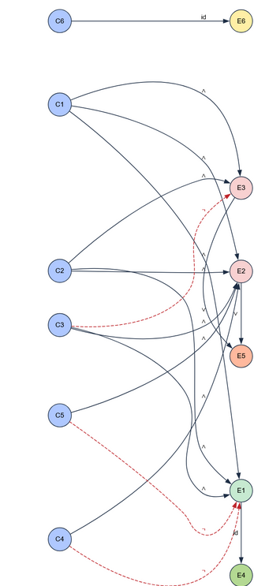
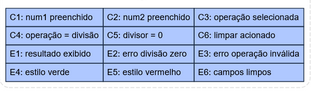

# Trabalho Prático - Teste de Software com Cypress

## 1. Descrição do Framework (Cypress)

### 1.1 O que é o Cypress?
O **Cypress** é um framework moderno de testes end-to-end (E2E) para aplicações web. Ele roda dentro do navegador, no mesmo loop de eventos da aplicação, oferecendo:
- Recarga automática
- Time-travel (visualização de cada comando executado)
- Esperas automáticas (reduz necessidade de `sleep`)
- API expressiva e simples
- Facilidade para validar DOM, estilos e estados de UI

Neste projeto utilizamos o Cypress para validar o comportamento funcional de uma **calculadora web** (operações básicas, mensagens de erro, feedback visual e limpeza de estado).

### 1.2 Por que Cypress neste projeto?
- Aplicação simples (HTML + JS) → foco direto em comportamento do usuário
- Ciclo rápido de feedback
- Verificação de estilos (cores de sucesso/erro)
- Execução determinística
- Fácil expansão para CI futuramente

---

## 2. Categorização dos Testes

### 2.1 Técnicas de Teste Aplicadas
| Técnica | Aplicação |
|--------|-----------|
| Caixa-Preta (Funcional) | Validação de operações e mensagens |
| Partição de Equivalência | Classes para números, operação e estados do resultado |
| Análise de Valor Limite (implícita) | Divisor = 0 vs divisor > 0 |
| Grafo de Causa-Efeito (simplificado) | Relação entradas → efeitos de UI/resultado |
| Teste de Exceção | Operação inválida, divisão por zero |
| Teste de Estado | Limpeza de campos e reset visual |
| (Didático) Execução passo a passo | Versão com `wait` para visualização |

### 2.2 Nível de Teste
- **Teste de Sistema / E2E** (principal)
- Simulação do fluxo real do usuário

### 2.3 Tipos de Testes Implementados
| Tipo | Exemplos |
|------|---------|
| Funcional | +, -, *, / |
| Negativo | Operação ausente, divisor zero |
| Fluxo alternativo | Limpar após operação |
| Parametrizado | Múltiplos numeradores na divisão por zero |
| Observabilidade | Versão “step” (delays didáticos) |

---

## 3. Aplicação sob Teste

Componentes:
- Inputs numéricos: `num1`, `num2`
- Select: `operacao` (`+`, `-`, `*`, `/`)
- Botões: `Calcular`, `Limpar`
- Área de resultado com feedback textual + cor

Regras:
1. Todos os campos obrigatórios
2. Divisão por zero gera erro
3. Operação ausente gera erro
4. Limpar apaga campos e resultado
5. Mensagens:
   - Sucesso: `O resultado da <operação> entre X e Y é: R`
   - Erro: `Erro: <mensagem>`

---

## 4. Código Principal (Resumo Lógico)

```javascript
switch (operacao) {
  case '+': soma
  case '-': subtracao
  case '*': multiplicacao
  case '/': divisao (erro se num2 === 0)
  default: erro "Operação inválida"
}
```

Feedback visual:
- Sucesso: fundo verde (#d4edda)
- Erro: fundo vermelho (#f8d7da)
- Reset: fundo padrão cinza (#e9ecef)

---

## 5. Estrutura do Projeto

```
.
├── index.html
├── src/
│   └── Calculadora.js
├── cypress/
│   ├── e2e/
│   │   ├── calculadora.cy.js          (suite principal)
│   │   └── calculadora-step.cy.js     (versão didática com waits)
│   ├── fixtures/
│   └── support/
│       ├── commands.js
│       └── e2e.js
├── cypress.config.js
├── package.json
└── README.md
```

---

## 6. Como Executar a Aplicação

### 6.1 Instalar Dependências
```bash
npm install
```

### 6.2 Iniciar Servidor Local
```bash
npx http-server . -p 3000
```
Acessar: `http://localhost:3000`

---

## 7. Como Executar os Testes

### 7.1 Instalar Cypress (se necessário)
```bash
npm install --save-dev cypress
```

### 7.2 Abrir Interface Interativa
```bash
npx cypress open
```
Rodar os arquivos em `cypress/e2e/`:
- `calculadora.cy.js`
- `calculadora-step.cy.js` (opcional, uso demonstrativo)

### 7.3 Modo Headless
```bash
npx cypress run
```

### 7.4 (Opcional) Cobertura de Código
Necessita instrumentação (`babel-plugin-istanbul` + `@cypress/code-coverage`). Não implementado neste escopo.

---

## 8. Casos de Teste Implementados

| Caso | Descrição | Categoria |
|------|-----------|-----------|
| Limpar campos | Reset após operação | Estado / Fluxo |
| Operação inválida | Sem seleção de operação | Negativo |
| Divisão por zero (parametrizado) | num2 = 0 em múltiplos numeradores | Exceção / Limite |
| Operações básicas | +, -, *, / corretas | Funcional |
| (Didático) Execução passo a passo | Mesmos cenários com esperas visuais | Observabilidade |

Obs: O arquivo `calculadora-step.cy.js` repete logicamente os testes apenas para visualização (não é recomendado usar `cy.wait` fixo em produção – uso pedagógico).

---

## 9. Partição de Equivalência

### 9.1 Entradas e Classes

#### num1 / num2
| Classe | Descrição | Exemplo | Resultado Esperado |
|--------|-----------|---------|--------------------|
| V1 | Número válido | 10 / 5 | Continua |
| V2 | Campo vazio | "" | Browser bloqueia (required) |
| V3 | Não numérico (não exercitado) | "abc" | Rejeitado pelo input |
| V4 | Divisor zero (num2) | 0 | Erro divisão |

#### Operação
| Classe | Descrição | Exemplo | Resultado |
|--------|-----------|---------|-----------|
| O1 | Operação válida | +, -, *, / | Cálculo |
| O2 | Não selecionada | "" | Erro operação inválida |

#### Resultado (estado UI)
| Classe | Descrição | Condição | Cor |
|--------|-----------|----------|-----|
| R1 | Sucesso | Operação válida | #d4edda |
| R2 | Erro operação | Operação ausente | #f8d7da |
| R3 | Erro divisão | Divisor zero | #f8d7da |
| R4 | Limpo | Após limpar | #e9ecef |

### 9.2 Casos Representativos

| num1 | operação | num2 | Classes Cobertas | Resultado |
|------|----------|------|------------------|-----------|
| 10 | + | 5 | V1,O1,R1 | 15 verde |
| 10 | - | 5 | V1,O1,R1 | 5 verde |
| 10 | * | 5 | V1,O1,R1 | 50 verde |
| 10 | / | 5 | V1,O1,R1 | 2 verde |
| 10 | / | 0 | V1,O1,V4,R3 | Erro divisão |
| 10 | "" | 5 | V1,O2,R2 | Erro operação |
| (após cálculo) | (Limpar) | - | R4 | Reset |

---

## 10. Análise de Valor Limite (Focada)

| Cenário | num1 | operação | num2 | Resultado |
|---------|------|----------|------|-----------|
| L1 | 10 | / | 0 | Erro divisão |
| L2 | 10 | / | 1 | 10 |

---

## 11. Grafo de Causa e Efeito



### 11.1 Causas (C)
| Causa | Significado |
|-------|-------------|
| C1 | num1 preenchido |
| C2 | num2 preenchido |
| C3 | operação selecionada |
| C4 | operação = divisão |
| C5 | divisor = 0 |
| C6 | limpar acionado |

### 11.2 Efeitos (E)
| Efeito | Significado |
|--------|------------|
| E1 | resultado exibido (sucesso) |
| E2 | erro: divisão por zero |
| E3 | erro: operação inválida |
| E4 | estilo verde |
| E5 | estilo vermelho |
| E6 | campos limpos |

### 11.3 Regras
- R1: C1 ∧ C2 ∧ C3 ∧ (¬C4 ∨ (C4 ∧ ¬C5)) → E1 ∧ E4
- R2: C1 ∧ C2 ∧ C3 ∧ C4 ∧ C5 → E2 ∧ E5
- R3: C1 ∧ C2 ∧ ¬C3 → E3 ∧ E5
- R4: C6 → E6 (sobrepõe estado anterior)

### 11.4 Grafo (ilustração)


### 11.5 Tabela de Decisão

| Caso | C1 | C2 | C3 | C4 | C5 | C6 | E1 | E2 | E3 | E4 | E5 | E6 |
|------|----|----|----|----|----|----|----|----|----|----|----|----|
| 1 Soma válida | 1 | 1 | 1 | 0 | 0 | 0 | 1 | 0 | 0 | 1 | 0 | 0 |
| 2 Divisão válida | 1 | 1 | 1 | 1 | 0 | 0 | 1 | 0 | 0 | 1 | 0 | 0 |
| 3 Divisão por zero | 1 | 1 | 1 | 1 | 1 | 0 | 0 | 1 | 0 | 0 | 1 | 0 |
| 4 Operação ausente | 1 | 1 | 0 | - | - | 0 | 0 | 0 | 1 | 0 | 1 | 0 |
| 5 Limpar após cálculo | 1 | 1 | 1 | 0 | 0 | 1 | 0 | 0 | 0 | 0 | 0 | 1 |

Legenda: 1 = Verdadeiro, 0 = Falso, - = Não se aplica.

---

## 12. Teste Estrutural (Apoio)

| Elemento | Tipo | Observação |
|----------|------|------------|
| `switch(operacao)` | Seleção múltipla | 4 cases + default |
| `if (num2 === 0)` | Decisão | Executa antes do resultado de divisão |
| `try/catch` | Controle de fluxo | Se erro: branch de erro |
| Evento limpar | Reset | Limpa DOM + estilo |

Complexidade ciclomática (aprox.): 6  
Todos os ramos exercitados pelos testes.

---

## 13. Caminhos Cobertos (Resumo)

| Caminho | Cenário |
|---------|---------|
| Soma | Operações básicas |
| Subtração | Operações básicas |
| Multiplicação | Operações básicas |
| Divisão válida | Operações básicas |
| Divisão por zero | Divisão por zero parametrizada |
| Default (operação inválida) | Operação não selecionada |
| Reset | Limpar campos |

---

## 14. Possíveis Extensões

| Ideia | Benefício |
|-------|----------|
| Floats / casas decimais | Precisão |
| Números negativos | Robustez |
| Valores grandes | Stress de exibição |
| Acessibilidade (teclado/ARIA) | Usabilidade ampliada |
| Pipeline CI (GitHub Actions) | Regressão contínua |
| Remover `cy.wait` fixos da versão step | Melhora desempenho |

---

## 15. Comandos Úteis

| Ação | Comando |
|------|---------|
| Instalar dependências | `npm install` |
| Subir servidor | `npx http-server . -p 3000` |
| Abrir Cypress | `npx cypress open` |
| Rodar headless | `npx cypress run` |

---

## 16. Conclusão

Cobertura prática dos principais comportamentos:
- Sucesso e erro nas operações
- Tratamento de exceções (divisão por zero, operação ausente)
- Feedback visual consistente
- Reset de estado
- Parametrização simples (divisão por zero com múltiplos numeradores)
- Versão demonstrativa “step” para fins pedagógicos

Estrutura preparada para expansão incremental (mais cenários, cobertura de código e integração contínua).

---

## 17. Referências

- [Documentação Cypress](https://docs.cypress.io/)
- Conceitos de Partição de Equivalência e Valor Limite
- Técnicas de Grafo Causa-Efeito (modelagem simplificada para E2E)

---
